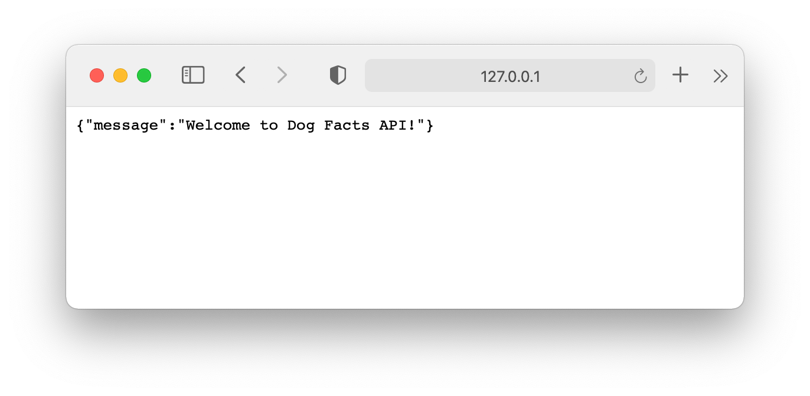
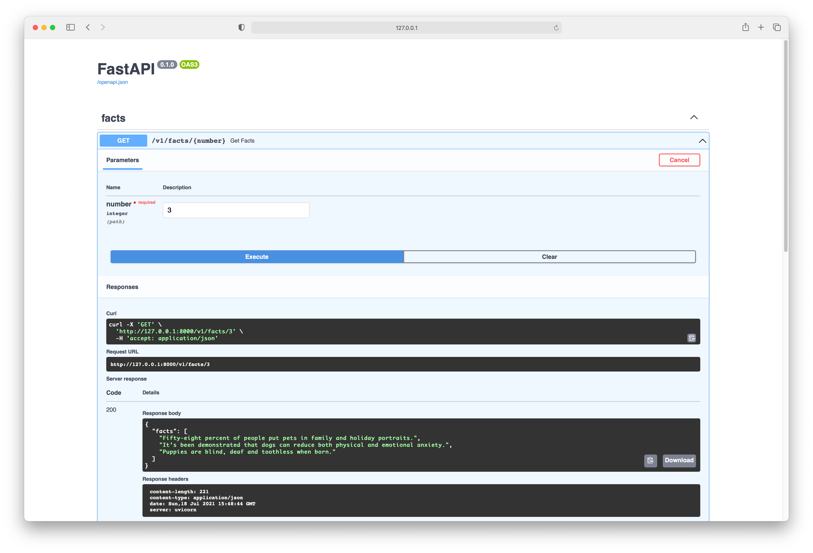

# Deploy an API service with FastAPI, Docker and Heroku (Part. 1)


# Introduction:
FastAPI is a modern, fast and highly performant web framework for building APIs using Python.
It also is quite beginner friendly since you don't need to set up many things to get started for a FastAPI project.
In this tutorial, we will start from scratch, set up the project, then we will create our API endpoints for 2 methods: GET and POST.
In part 2 of the tutorial, we will continue by containerizing the app with Docker and deploy the container to Heroku Container Registry for serving to the public.

Requirements for this tutorial is just some basic knowledge with Python Programming and some understanding of APIs.


# Set up

Skip this step if you already knew what to do :wink:

## Repository:

- Create the project and go inside it:

  ```
  mkdir dog-facts-api && cd $_
  ```

- Initialize a git project:

  ```
  git init
  ```

- I like to have some files to get started:

  ```
  touch README.md .gitignore requirements.txt main.py config.py
  ```

  - That should create 5 files:

    - `README.md`: the description/guide for how to use the API.
    - `.gitignore`: ignore a certain pattern of file for git. You can use [gitignore.io](https://www.toptal.com/developers/gitignore) to generate a quick one (although I don't like how broad it is, but you decide!)
    - `requirements.txt`: list of all dependencies in our app. The file should look like this (for now):

      ```txt
      fastapi
      uvicorn
      python-dotenv
      ```

    - `main.py`: the main python script to serve requests.
    - `config.py`: script to load environment variable for our app.

- For this tutorial, you can download the data of dog facts [here](https://github.com/DukeNgn/Dog-facts-API/blob/master/data.json), and put it in the same level of the main directory (this was the dataset I used for my own Dog-facts-API v1)

- A common practice for working in a python project is creating a virtual environment for the project. If you prefer [poetry](https://python-poetry.org/), it has its own command. Else, you can run this command in your terminal:

  ```
  python -m venv venv
  ```

  This creates a folder called `venv` in your directory. This folder hosts the virtual environment for your app.

  > **Note:** Make sure your python version is python 3. On some Unix environments, you might need to use `python3` instead depends on your python set up.

- Activate the environment by:

  ```
  source venv/bin/activate
  ```

- Install dependencies:

  ```
  pip install -r requirements.txt
  ```

  The `-r` flag here is to tell `pip` to install recursively all the packages in `requirements.txt`.

- _voilà_, we've done setting up the project. The directory tree should look like this at the moment:

  ```
  .
  ├── README.md
  ├── main.py
  ├── data.json
  ├── requirements.txt
  └── venv

  1 directories, 4 files
  ```

# First endpoint:

- In `main.py`, first we need to create a `FastAPI` object for our app:

  ```python
  from fastapi import FastAPI

  app = FastAPI()

  @app.get("/")
  async def home():
      return {"message": "Welcome to Dog Facts API!"}

  ```

  - `app = FastAPI()` initializes the FastAPI object for us to use throughout the app.
  - `@app.get("/")` instructs fast api to use the `home()` function to handle all `GET` requests that start with `/`. Note that `GET` is only one of several operations supported by FastAPI, read more about others [here](https://fastapi.tiangolo.com/tutorial/first-steps/#operation)

  ```
  async def home():
      return {"message": "Welcome to Dog Facts API!"
  ```

  - This function handles any request to this endpoint.

  We will definitely have more endpoints for our API service, but all will follow the same format as this code block.

- Start the live server by:

  ```
  uvicorn main:app --reload
  ```

  (the `--reload` flag here is for continuous rebuild as we update the project.)

- You should see something like this:

  ```
  INFO:     Uvicorn running on http://127.0.0.1:8000 (Press CTRL+C to quit)
  INFO:     Started reloader process [21716] using statreload
  INFO:     Started server process [21719]
  INFO:     Waiting for application startup.
  INFO:     Application startup complete.

  ```

  means the app successfully started.

- Head to the link in this log message. Usually, it's `http://127.0.0.1:8000`:
  

  Well done! you've created the very first API endpoint for your application! Any request in your local machine heads to this link will get `{"message": "Welcome to Dog Facts API!"}` as a response.

- If you go to `{your-url}/docs` now, there should be an auto-generated documentation of your API. You can see all the available endpoints in the project and you can even make requests with it. Pretty cool, right, right ??!!

# Build the service

- Now go ahead and create a folder called `v1`. We may have more versions of the API service in the future, so we should have a naming convention to organize the folders.
- Inside `v1`, create another folder, named `routers`. This folder hosts the code for our endpoints.
- Create `facts.py` in `routers` for all endpoints related to dog-facts.
- The directory now looks like this:

  ```
  ├── v1
  │   └── routers
  │       └── facts.py
  ```

  **Note:** Fell free to use other coding organization. However, this is the set up I find the most convenient for scaling up.

- In `facts.api`, we create our `GET` endpoint which serves dog facts to clients.

  ```python
  import json
  import random
  from typing import List, Tuple

  from fastapi import APIRouter, HTTPException

  from config import DATA_PATH

  router = APIRouter(
      prefix="/v1/facts", tags=["facts"], responses={"404": {"description": "Not found"}}
  )


  def get_data() -> Tuple[dict, int]:
      data_file = open(DATA_PATH, "r")
      data = json.load(data_file)
      random.shuffle(data)
      num_of_entry = len(data)
      return data, num_of_entry


  @router.get("/{number}")
  async def get_facts(number: int) -> dict:
      data, num_of_entry = get_data()
      if number <= 0 or number > num_of_entry:
          raise HTTPException(
              status_code=400,
              detail=f"Number of facts should be in range of 1 to {num_of_entry}. You requested {number}",
          )

      return {"facts": [entry.get("fact") for entry in data[:number]]}

  ```

  Let's dive in!

  - Initialize the router:

  ```python
  router = APIRouter(
      prefix="/v1/facts", tags=["facts"], responses={"404": {"description": "Not found"}}
  )
  ```

  > You can think of `APIRouter` as a mini `FastAPI` class (official documentation)

  This creates a router for our app. All request with prefix `/v1/facts` should be sent to this router for handling. That means it matches with URLs such as `http://127.0.0.1:8000/v1/facts/`.
  The default response in this route is a `404` error in case the request does not match any defined endpoints here.

  - Extract data from the data json file:

  ```python
   def get_data() -> Tuple[dict, int]:
      data_file = open(DATA_PATH, "r")
      data = json.load(data_file)
      random.shuffle(data)
      num_of_entry = len(data)
      return data, num_of_entry
  ```

  This part perfoms a simple I/O operation to read the data file from json, then shuffles it and returns back the data in as a `dict` along with a variable `num_of_entry` which is the total number of entries there're in data file.

  - Create GET endpoint:

  ```python
  @router.get("/{number}")
  ```

  This creates a GET end point with variable `number`. Keep in mind here that we're only using the route `/{number}`, but in fact, the full route should be: `http://127.0.0.1:8000/v1/facts/{number}`. However, the first part was prefixed when we created the router so we don't need to worry about it.

  - The function takes an argument `number` which is the number that was passed in from the request URL: `/{number}`. It then calls the support function `get_data()` to extract the data from json file.

  ```python
  async def get_facts(number: int) -> dict:
      data, num_of_entry = get_data()

  ```

  - Next, we have a condition to check if the number user requested is invalid (either less/equal than 0 or greater than the number of entries we have)

  ```python
  if number <= 0 or number > num_of_entry:
  ```

  - If it's an invalid request from user, we raise an HTTP Exception to let user know that we rejected:

  ```python
  raise HTTPException(
          status_code=400,
          detail=f"Number of facts should be in range of 1 to {num_of_entry}. You requested {number}",
      )
  ```

  - Make a test request using the interactive UI from FastAPI:
    

* Similarly, we add one more endpoint for updating new entry for our service.

  - First, we create a simple class to hold the new fact:

  ```python
  class Fact(BaseModel):
      """Represents a dog fact"""

      description: str
  ```

  This class is simple enough that you _might_ not need it. However, it's a good practice to represents the object client uploads by a class.

  - Next, create the route, but this time with `POST` method since we're accepting new fact coming in from the client.

  ```python
  def update_data(new_data: List[dict]) -> None:
      data_file = open(DATA_PATH, "w")
      json.dump(new_data, data_file, indent=4)


  def is_duplicate(new_entry: Fact, data: List[dict]) -> bool:
      return any(
          new_entry.description.lower() == each.get("fact").lower() for each in data
      )

  @router.post("/new")
  async def create_fact(entry: Fact, x_token: str = Header(...)) -> Fact:
      if x_token != SECRET_TOKEN:
          raise HTTPException(status_code=400, detail="X-Token header invalid")

      data, _ = get_data()
      if is_duplicate(entry, data):
          raise HTTPException(status_code=400, detail=f"Fact already existed")

      data.append({"fact": entry.description})
      update_data(data)
      return entry
  ```

  - `update_data()` is used to add a new entry to the data file.
  - `is_duplicate()` checks if the entry already existed in data. We don't want to add another fact that simply is a duplicate.
  - `@router.post("/new")` Notices that we're using a different operation this time. This is a `post` method, it requires the client to send data in the request body.
  - `async def create_fact(entry: Fact, x_token: str = Header(...)) -> Fact:` The first parameter `entry` is required to be the content of the request body from clients. The second parameter is the `x-token` we're expecting from the request. This token is used authorize the request. The reason behind this is POST method usually modify our data, so we want to filter out all the unauthorized requests.
  - We then check if the passing token is valid. If not, we raise an exception to notify the client side.
    ```python
    if x_token != SECRET_TOKEN:
          raise HTTPException(status_code=400, detail="X-Token header invalid")
    ```
  - Next part of the code is pretty straightfoward:

    ```python
        data, _ = get_data()
        if is_duplicate(entry, data):
            raise HTTPException(status_code=400, detail=f"Fact already existed")

        data.append({"fact": entry.description})
        update_data(data)
        return entry
    ```

    If we know that the new fact is a duplicate, we raise an HTTP Exception immediately with code `400` (Bad request). Else, we append the new fact to our data and update the data file. Finally, we return the entry itself to let the client know that the request was successful.

# Conclusion

That concludes part 1 of the tutorial to deploy an API service using FastAPI. Now, you have an API service that is ready to be deployed.
In part 2 of this tutorial, we will do some DevOps with Docker and deploy the API to Heroku for public usage.
