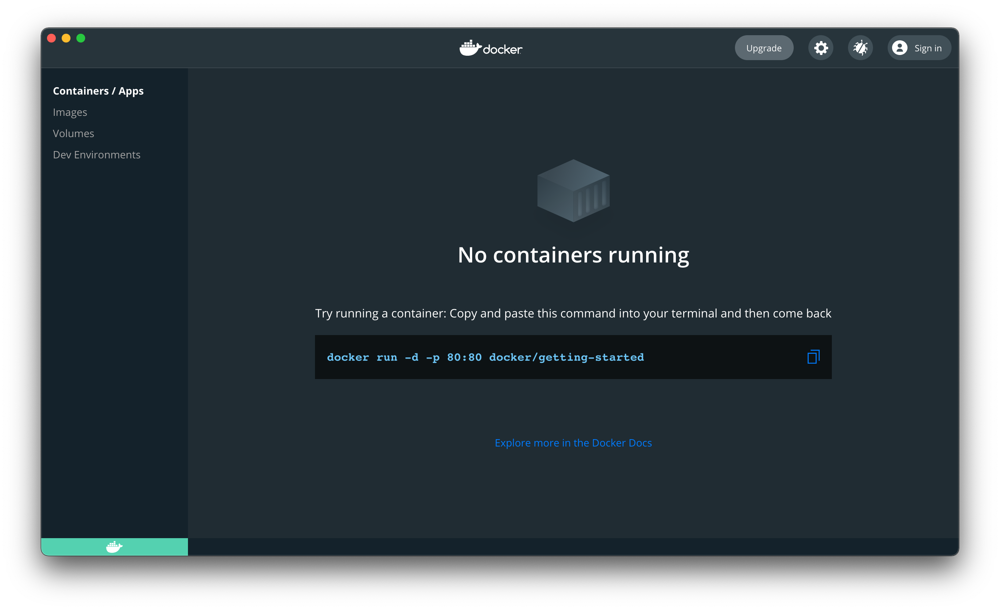

## Docker:

Docker provides a great way to package and run applications in an isolated environment regardless of your host. The isolated environment is called a container. Read more about Docker here: [overview](https://docs.docker.com/get-started/overview/)

In this tutorial, we'll be using Docker to containerize our API service before deploy to Heroku.

- Go through the steps in [docker.com/get-docker](https://docs.docker.com/get-docker/) and install Docker Desktop (for Mac and Windows) or Docker for Linux Distribution
- After installing run :
  ```
  docker info
  ```
  on the terminal to verify if the installation was successful.
- If you get something like this:

```bash
Client:
 Context:    default
 Debug Mode: false
 Plugins:
  buildx: Build with BuildKit (Docker Inc., v0.5.1-docker)
  compose: Docker Compose (Docker Inc., 2.0.0-beta.3)
  scan: Docker Scan (Docker Inc., v0.8.0)

...
```

You're good to go :like:

_Note:_ If you encounter something like:

```
ERROR: Error response from daemon: dial unix docker.raw.sock: connect: connection refused
errors pretty printing info
```

It means that the docker daemon might not started. You will need to manually open Docker Desktop app to get the daemon started and running. The app should appear like so:



## Heroku